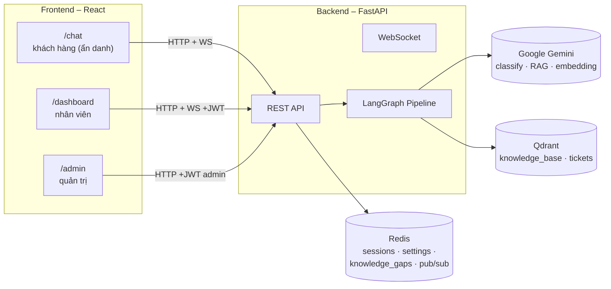

# Tổng đài Hỗ trợ Tự vận hành — E-commerce Support Automation

Bot chăm sóc khách hàng tự động cho sàn thương mại điện tử: tiếp nhận yêu cầu, phân loại,
tự trả lời khi đủ căn cứ tài liệu, và chuyển nhân viên khi không đủ tin cậy hoặc cần xử lý
thủ công — kèm dashboard vận hành cho nhân viên/quản trị.

> Track D — Automation/Agent. Xem chi tiết thiết kế ở [`docs/ARCHITECTURE.md`](docs/ARCHITECTURE.md).

📺 **Video demo (≤5 phút):** _TODO: điền link video_
🔗 **Sản phẩm triển khai:** Chưa deploy public — chạy local qua Docker (xem hướng dẫn bên dưới)

---

## 1. Tóm tắt kiến trúc



- **Backend**: FastAPI + [LangGraph](https://github.com/langchain-ai/langgraph) điều phối pipeline xử lý yêu cầu (ingest → check trùng lặp → phân loại → RAG/escalate).
- **AI**: Google Gemini — phân loại 8 nhóm yêu cầu, sinh câu trả lời RAG, và **tự đánh giá độ tin cậy** của câu trả lời (không dùng ngưỡng số cứng) để quyết định tự xử lý hay chuyển người.
- **Lưu trữ**: Qdrant (vector search cho knowledge base + phát hiện trùng lặp ngữ nghĩa), Redis (session, cấu hình AI, khoảng trống kiến thức, pub/sub cho chat real-time).
- **Frontend**: React + TypeScript + Vite — 3 giao diện: Chat (khách hàng, không cần đăng nhập), Dashboard (nhân viên), Admin (quản trị + quan sát vận hành).

Chi tiết luồng xử lý từng bước, lý do thiết kế và trade-off: xem [`docs/ARCHITECTURE.md`](docs/ARCHITECTURE.md).

## 2. Công cụ, mô hình & API sử dụng

| Thành phần | Công nghệ |
|---|---|
| Backend framework | FastAPI, Uvicorn |
| Điều phối AI pipeline | LangGraph |
| LLM | Google Gemini (`google-genai` SDK) — model phân loại + model sinh câu trả lời (cấu hình riêng qua `.env`) |
| Vector DB | Qdrant |
| Cache / Pub-sub / Persistence | Redis |
| Auth | JWT (`PyJWT`) + `bcrypt` |
| Retry/backoff cho gọi LLM | `tenacity` |
| Test backend | `pytest`, `pytest-mock`, `httpx` |
| Frontend | React 19, TypeScript, Vite, React Router, Recharts, lucide-react |
| Test frontend | Vitest, React Testing Library |
| Hạ tầng dev | Docker Compose |

## 3. Hướng dẫn cài đặt & khởi chạy

### Yêu cầu
- Docker + Docker Compose
- Node.js 18+ (chạy frontend dev server)
- 1 Gemini API key ([Google AI Studio](https://aistudio.google.com/apikey))

### Bước 1 — Cấu hình biến môi trường
```bash
cp .env.example .env
# Mở .env, điền GEMINI_API_KEY
```

### Bước 2 — Khởi chạy backend (Redis + Qdrant + FastAPI)
```bash
docker compose up -d
```
Kiểm tra: `curl http://localhost:8000/health` → `{"healthy": true, ...}`

### Bước 3 — Nạp dữ liệu Knowledge Base mẫu
```bash
docker compose exec backend python scripts/init_db.py
```
Xem danh sách tài liệu mẫu ở [`docs/SAMPLE_DATA.md`](docs/SAMPLE_DATA.md). Có thể thêm/sửa tài liệu sau này ngay trên UI Admin > Knowledge Base, không cần chạy lại script.

### Bước 4 — Chạy frontend
```bash
cd frontend
cp .env.example .env   # mặc định trỏ về http://localhost:8000, đổi nếu backend chạy nơi khác
npm install
npm run dev
```
Mở `http://localhost:5173`.

### Tài khoản demo (đăng nhập ở `/login`)
| Email | Mật khẩu | Vai trò |
|---|---|---|
| `admin@demo.com` | `123` | Quản trị — `/admin` |
| `staff@demo.com` | `123` | Nhân viên — `/dashboard` |
| `staff2@demo.com` | `123` | Nhân viên — `/dashboard` |

Khách hàng vào thẳng `/chat`, **không cần đăng nhập**.

## 4. Chạy test

```bash
# Backend — không cần Redis/Qdrant/Gemini thật, toàn bộ mock qua conftest.py
docker compose build backend
docker compose run --rm --no-deps backend pytest tests/ -v

# Frontend
cd frontend && npm run test
```

## 5. Cấu trúc thư mục

```
backend/
  app/
    api/            # routes.py (REST), ws.py (WebSocket), auth_routes.py
    graph/          # nodes.py + workflow.py — pipeline LangGraph
    llm.py          # Gemini client (classify, RAG, embedding)
    auth.py         # JWT + role-based access
    session_store.py, settings_store.py, knowledge_gaps.py   # Redis-backed state
  scripts/init_db.py  # seed Knowledge Base vào Qdrant
  tests/            # pytest, mock hết service ngoài
frontend/
  src/pages/        # Chat.tsx, Dashboard.tsx, Admin.tsx, Login.tsx
  src/AuthContext.tsx
docs/
  ARCHITECTURE.md   # thiết kế chi tiết + quyết định kỹ thuật
  SAMPLE_DATA.md     # dữ liệu mẫu + kịch bản test
```

## 6. Giới hạn đã biết (chưa làm, có chủ đích)

- **Đa kênh**: API hỗ trợ `channel` là `web_chat/email/messaging_app/internal_system`, nhưng chỉ `web_chat` có giao diện thật kết nối — chưa build connector email/Messenger thật (ngoài phạm vi trọng tâm bài toán AI routing).
- **Quản lý nhân sự**: danh sách nhân viên ở Admin vẫn là dữ liệu mẫu, tài khoản đăng nhập hardcode 3 tài khoản demo (mật khẩu đã hash bcrypt, xác thực thật ở backend — chỉ chưa có user database).
- **Test frontend**: mới phủ `Chat`/`Login`, chưa có cho `Dashboard`/`Admin`.
