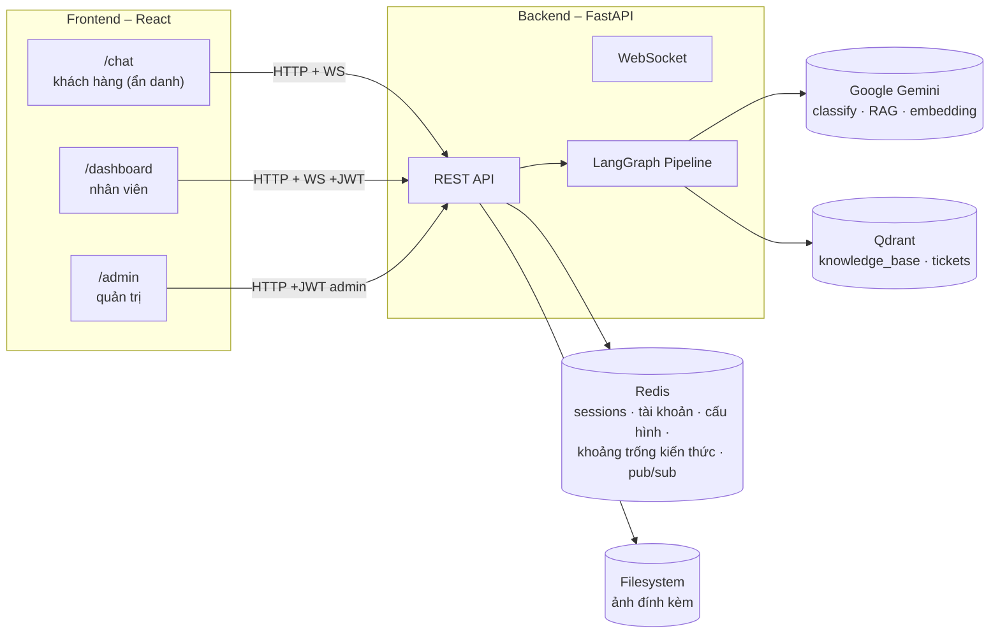

# Tổng đài Hỗ trợ Tự vận hành — E-commerce Support Automation

Bot chăm sóc khách hàng tự động cho sàn thương mại điện tử: tiếp nhận yêu cầu, phân loại,
tự trả lời khi đủ căn cứ tài liệu, và chuyển nhân viên kèm đầy đủ bối cảnh khi không đủ tin
cậy hoặc cần xử lý thủ công — kèm dashboard vận hành cho nhân viên/quản trị.

**Video demo (≤5 phút):** [Xem trên Google Drive](https://drive.google.com/file/d/1HPB5TWuCOM8O6351oXVm4sCIV07Uo28e/view?usp=sharing)

**Sản phẩm triển khai:** Chưa deploy public — chạy local qua Docker (xem hướng dẫn bên dưới)

---

## 1. Tính năng chính

- **Tiếp nhận & phân loại**: 8 nhóm yêu cầu (hỏi đáp, khiếu nại, kỹ thuật, thanh toán, khẩn
  cấp, spam, thiếu thông tin, yêu cầu gặp người) + phát hiện trùng lặp theo ngữ nghĩa.
- **Trả lời tự động có trích nguồn (RAG)**: chỉ dùng tài liệu nội bộ, không bịa.
- **Tự nhận biết "không đủ căn cứ"**: Gemini tự đánh giá độ tin cậy câu trả lời (không dùng
  ngưỡng số cứng) và chủ động chuyển người khi không chắc chắn — xem lý do thiết kế ở
  [`docs/ARCHITECTURE.md`](docs/ARCHITECTURE.md#3-vì-sao-độ-tin-cậy-do-gemini-tự-đánh-giá-không-dùng-ngưỡng-similarity).
- **Vòng lặp tự cải thiện Knowledge Base**: câu hỏi AI chưa trả lời được tự động ghi lại để
  admin bổ sung tài liệu.
- **Đính kèm ảnh**: khách hàng gửi kèm ảnh khi khiếu nại; ảnh chỉ dùng làm ngữ cảnh trực quan
  cho nhân viên, AI không phân tích nội dung ảnh (không dùng Gemini vision).
- **Dashboard nhân viên**: nhận ticket real-time (âm thanh + browser notification), xem lý do
  AI chuyển, chat trực tiếp qua WebSocket, đóng ca.
- **Trang quản trị**: số liệu vận hành thật (không mock), cấu hình AI động (ngưỡng lọc, cửa
  sổ trùng lặp, từ khoá escalate), quản lý Knowledge Base, quản lý tài khoản nhân viên, theo
  dõi CSAT (khách đánh giá 👍/👎 câu trả lời).
- **Auth thật**: JWT + bcrypt, tài khoản nhân viên lưu động (không hardcode), khách hàng ẩn
  danh không cần đăng nhập.

## 2. Tóm tắt kiến trúc



- **Backend**: FastAPI + [LangGraph](https://github.com/langchain-ai/langgraph) điều phối pipeline xử lý yêu cầu (ingest → check trùng lặp → phân loại → RAG/escalate).
- **AI**: Google Gemini — phân loại 8 nhóm yêu cầu, sinh câu trả lời RAG, và **tự đánh giá độ tin cậy** của câu trả lời (không dùng ngưỡng số cứng) để quyết định tự xử lý hay chuyển người.
- **Lưu trữ**: Qdrant (vector search cho knowledge base + phát hiện trùng lặp ngữ nghĩa), Redis (session, tài khoản nhân viên, cấu hình AI, khoảng trống kiến thức, pub/sub cho chat real-time), filesystem qua Docker volume (ảnh đính kèm).
- **Frontend**: React + TypeScript + Vite — 3 giao diện: Chat (khách hàng, không cần đăng nhập), Dashboard (nhân viên), Admin (quản trị + quan sát vận hành).

Chi tiết luồng xử lý từng bước, lý do thiết kế và trade-off: xem [`docs/ARCHITECTURE.md`](docs/ARCHITECTURE.md).

## 3. Công cụ, mô hình & API sử dụng

| Thành phần | Công nghệ |
|---|---|
| Backend framework | FastAPI, Uvicorn |
| Điều phối AI pipeline | LangGraph |
| LLM | Google Gemini (`google-genai` SDK) — model phân loại + model sinh câu trả lời cấu hình riêng qua `.env` (`GEMINI_MODEL_FAST`, `GEMINI_MODEL_QUALITY`) |
| Vector DB | Qdrant |
| Cache / Pub-sub / Persistence | Redis |
| Auth | JWT (`PyJWT`) + `bcrypt` |
| Upload ảnh | `python-multipart` (FastAPI `UploadFile`), lưu filesystem qua Docker volume |
| Retry/backoff cho gọi LLM | `tenacity` |
| Test backend | `pytest`, `pytest-mock`, `httpx` (73 test, mock toàn bộ Redis/Qdrant/Gemini) |
| Frontend | React 19, TypeScript, Vite, React Router, Recharts, lucide-react, react-markdown |
| Test frontend | Vitest, React Testing Library |
| Hạ tầng dev | Docker Compose |

## 4. Hướng dẫn cài đặt & khởi chạy

### Yêu cầu
- Docker + Docker Compose
- Node.js 18+ (chạy frontend dev server)
- 1 Gemini API key ([Google AI Studio](https://aistudio.google.com/apikey))

### Bước 1 — Cấu hình biến môi trường
```bash
cp .env.example .env
# Mở .env, điền GEMINI_API_KEY
```

> **Lưu ý về giới hạn Gemini free tier**: gói miễn phí giới hạn khoảng 20 request/ngày cho
> mỗi cặp (project, model) — mỗi lần khách gửi 1 tin nhắn tốn tối thiểu 2 lệnh gọi (phân
> loại + sinh câu trả lời), nên rất dễ hết hạn mức khi test nhiều. Nếu gặp lỗi 429, xem
> `GEMINI_MODEL_FAST`/`GEMINI_MODEL_QUALITY` trong `.env.example` — trỏ về alias
> `gemini-flash-latest` (Google tự động trỏ tới model ổn định mới nhất khả dụng cho mọi
> project) thường an toàn hơn ghim cứng 1 phiên bản model cụ thể.

### Bước 2 — Khởi chạy backend (Redis + Qdrant + FastAPI)
```bash
docker compose up -d
```
Kiểm tra: `curl http://localhost:8000/health` → `{"healthy": true, ...}`

### Bước 3 — Nạp dữ liệu Knowledge Base mẫu
```bash
docker compose exec backend python scripts/init_db.py
```
Xem danh sách tài liệu mẫu ở [`docs/SAMPLE_DATA.md`](docs/SAMPLE_DATA.md). Có thể thêm/sửa tài liệu sau này ngay trên UI Admin > Knowledge Base, không cần chạy lại script.

### Bước 4 — Chạy frontend
```bash
cd frontend
cp .env.example .env   # mặc định trỏ về http://localhost:8000, đổi nếu backend chạy nơi khác
npm install
npm run dev
```
Mở `http://localhost:5173`.

### Tài khoản demo (đăng nhập ở `/login`)
| Email | Mật khẩu | Vai trò |
|---|---|---|
| `admin@demo.com` | `123` | Quản trị — `/admin` |
| `staff@demo.com` | `123` | Nhân viên — `/dashboard` |
| `staff2@demo.com` | `123` | Nhân viên — `/dashboard` |

3 tài khoản trên được tự seed vào Redis khi backend khởi động lần đầu (idempotent — không
ghi đè nếu đã có dữ liệu). Admin có thể thêm/xoá tài khoản thật qua tab **Quản lý nhân sự**.

Khách hàng vào thẳng `/chat`, **không cần đăng nhập**. Bấm "Cuộc hội thoại mới" ở góc trên để
bắt đầu phiên chat sạch (sinh mã khách hàng mới, không dùng chung lịch sử với phiên trước).

## 5. Chạy test

```bash
# Backend — không cần Redis/Qdrant/Gemini thật, toàn bộ mock qua conftest.py
docker compose build backend
docker compose run --rm --no-deps backend pytest tests/ -v

# Frontend
cd frontend && npm run test
```

## 6. Cấu trúc thư mục

```
backend/
  app/
    api/            # routes.py (REST), ws.py (WebSocket), auth_routes.py
    graph/          # nodes.py + workflow.py + state.py — pipeline LangGraph
    llm.py          # Gemini client (classify, RAG, embedding) + retry/backoff
    auth.py         # JWT + role-based access
    uploads.py      # validate + lưu ảnh đính kèm
    session_store.py, settings_store.py, knowledge_gaps.py, staff_store.py  # Redis-backed state
  scripts/init_db.py  # seed Knowledge Base vào Qdrant
  tests/            # pytest, mock hết service ngoài (73 test)
frontend/
  src/pages/        # Chat.tsx, Dashboard.tsx, Admin.tsx, Login.tsx
  src/AuthContext.tsx, src/config.ts   # API_BASE/WS_BASE từ biến môi trường
docs/
  ARCHITECTURE.md   # thiết kế chi tiết + quyết định kỹ thuật
  SAMPLE_DATA.md    # dữ liệu mẫu + kịch bản test
```

## 7. Giới hạn đã biết

- **Đa kênh**: chỉ `web_chat` có giao diện thật; `email`/`messaging_app`/`internal_system` mới dừng ở mức API hỗ trợ tham số, chưa có connector.
- **Xử lý đồng thời**: pipeline AI (Gemini, Qdrant, Redis cấu hình) gọi đồng bộ ngay trong request — nhiều khách gửi tin cùng lúc có thể bị dồn độ trễ, chưa tối ưu bằng threadpool/client async.

