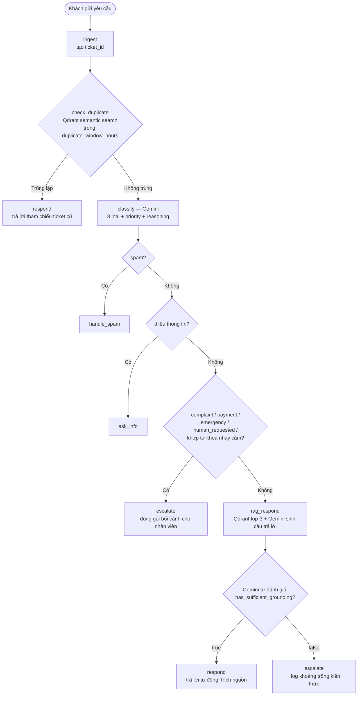

# Kiến trúc hệ thống

## 1. Bài toán

Xây dựng tổng đài hỗ trợ khách hàng tự vận hành: tiếp nhận yêu cầu, tự xử lý khi đủ thông
tin/độ tin cậy, và chuyển nhân sự phụ trách kèm đủ bối cảnh khi không thể xử lý an toàn.
Yêu cầu được phân vào 8 nhóm: hỏi đáp thông tin, khiếu nại, yêu cầu kỹ thuật, yêu cầu
thanh toán, khẩn cấp, spam, trùng lặp, thiếu thông tin — mỗi nhóm có mức ưu tiên và luồng
xử lý riêng.

## 2. Pipeline xử lý (LangGraph)

Mỗi yêu cầu đi qua 1 state graph, mỗi node chỉ trả về phần state cần cập nhật (không ghi
đè toàn bộ), `processing_log` được append xuyên suốt để phục vụ quan sát vận hành.



### Vai trò từng node (`backend/app/graph/nodes.py`)

| Node | Nhiệm vụ |
|---|---|
| `ingest` | Tạo `ticket_id`, ghi log kênh + khách hàng |
| `check_duplicate` | Embed câu hỏi, tìm ticket cũ *của cùng khách hàng* trong Qdrant (collection `tickets`), giới hạn theo `duplicate_window_hours` (cấu hình được ở Admin); score ≥ 0.95 → coi là trùng lặp |
| `classify` | Gọi Gemini (JSON mode) phân loại 8 nhóm + priority + `has_sufficient_info`/`requires_human`; sau đó so thêm với danh sách từ khoá escalate thủ công (cấu hình ở Admin) để ép escalate nếu khớp |
| `handle_spam` / `ask_info` | Node kết thúc đơn giản — log và trả phản hồi tương ứng |
| `rag_respond` | Tìm top-3 tài liệu trong Qdrant (collection `knowledge_base`, lọc bớt bằng `similarity_threshold`), đưa cho Gemini đọc cùng câu hỏi, nhận lại `{answer, has_sufficient_grounding, reasoning}` |
| `escalate` | Đóng gói `ticket_id`, `classification`, `priority`, `escalation_reason` — đây là bối cảnh nhân viên thấy khi tiếp nhận ca |
| `respond` | Chốt `status = resolved` (trừ trường hợp duplicate đã set response từ trước) |

## 3. Vì sao "độ tin cậy" do Gemini tự đánh giá, không dùng ngưỡng similarity

Thiết kế ban đầu: `passed_gate = best_score >= similarity_threshold` — nếu điểm cosine
similarity thấp hơn ngưỡng, hệ thống vẫn cho Gemini trả lời bằng kiến thức chung và đóng
ticket "resolved". Đây là lỗi thiết kế: **similarity không đo được "đủ căn cứ để trả lời
đúng hay không"** — một tài liệu điểm thấp có thể trả lời chính xác, một tài liệu điểm cao
có thể chỉ khớp từ ngữ bề mặt.

Thiết kế hiện tại: lấy top-3 tài liệu gần nhất (đã lọc rác bằng `similarity_threshold` ở
tầng retrieval), đưa **toàn bộ** cho Gemini đọc cùng câu hỏi. Gemini trả về JSON có cấu
trúc:

```json
{
  "answer": "...",
  "has_sufficient_grounding": true/false,
  "reasoning": "..."
}
```

Quyết định resolved/escalate dựa **thẳng vào `has_sufficient_grounding`** — không quy đổi
qua con số nào nữa. Khi lỗi gọi API (mất mạng, hết quota...), fallback về
`has_sufficient_grounding=False`: không chắc chắn thì phải chuyển người, đúng tinh thần
"an toàn" của đề bài, thay vì âm thầm trả lời sai.

## 4. Vòng lặp tự cải thiện Knowledge Base

Mỗi lần `has_sufficient_grounding=False`, câu hỏi + lý do được ghi vào Redis
(`app/knowledge_gaps.py`). Admin xem danh sách này ở tab Knowledge Base, bấm vào 1 mục để
nhanh chóng thêm tài liệu trả lời — biến việc escalate thành dữ liệu đầu vào cải thiện
KB, thay vì chỉ là một lối thoát.

## 5. Auth & phân quyền

JWT Bearer token (`app/auth.py`), không dùng session cookie để tránh phức tạp CORS
credential khi frontend là SPA gọi API qua origin/port khác nhau. Tài khoản nhân viên lưu ở
Redis (`app/staff_store.py`), không hardcode — 3 tài khoản demo được seed idempotent lúc
backend khởi động (`main.py` lifespan).

| Endpoint | Yêu cầu |
|---|---|
| `POST /api/support/submit`, `GET /api/support/session/{id}`, `POST /api/support/upload`, `POST /api/support/tickets/{id}/rate` | Công khai — khách hàng ẩn danh vẫn dùng được |
| `GET /api/support/tickets`, `.../accept`, `.../close` | Role `staff` hoặc `admin` |
| `GET/PUT /api/support/settings`, toàn bộ `/kb`, `/staff`, `/stats`, `/knowledge-gaps` | Role `admin` |
| WebSocket `/ws/chat/{id}` | Không bắt buộc token (khách hàng ẩn danh), nhưng chỉ connection có `?token=` hợp lệ (staff/admin) mới được gửi `role: "bot"` — chặn giả danh nhân viên |

## 6. Lưu trữ dữ liệu

| Dữ liệu | Nơi lưu | Lý do |
|---|---|---|
| Session/ticket khách hàng (kèm `createdAt` ISO datetime, `csat_rating`) | Redis (`support:session:*`) | Cần persist qua restart, JSON đơn giản, không cần quan hệ phức tạp |
| Tài khoản nhân viên (bcrypt hash) | Redis (`support:staff:*`) | Đọc/ghi qua API async, không cần quan hệ phức tạp |
| Cấu hình AI (threshold, duplicate window, escalate keywords) | Redis (`support:ai_settings`) | Đọc từ cả LangGraph node (sync) lẫn API (async) |
| Khoảng trống kiến thức | Redis list (`support:knowledge_gaps`, giữ tối đa 200 bản ghi) | Chỉ cần đọc gần đây, không cần query phức tạp |
| Tài liệu Knowledge Base | Qdrant (`knowledge_base`) | Cần vector search |
| Lịch sử ticket để phát hiện trùng lặp | Qdrant (`tickets`) | Cần semantic search theo khách hàng + thời gian |
| Ảnh đính kèm | Filesystem, Docker volume `uploads_data` | File nhị phân, không phù hợp lưu trong Redis/Qdrant; tên file random (UUID) tránh path traversal, serve qua `StaticFiles` |

## 7. Quan sát vận hành (Admin)

- **Tổng quan**: tổng requests, tỷ lệ tự xử lý, số ca chuyển nhân viên, tỷ lệ hài lòng CSAT (👍/👎 khách tự đánh giá), biểu đồ theo giờ/loại/tự động vs escalate — tính trực tiếp từ session store thật, không mock.
- **Giám sát vận hành**: trạng thái Redis/Qdrant thật (`/health`), log xử lý AI gần nhất.
- **Knowledge Base**: xem/sửa/xoá tài liệu, và danh sách "câu hỏi chưa trả lời được" (mục 4).
- **Quản lý nhân sự**: thêm/xoá tài khoản nhân viên thật; chặn tự xoá chính mình và xoá admin cuối cùng.

Dashboard nhân viên chủ động báo ticket mới bằng âm thanh (Web Audio API) + browser
Notification, so sánh danh sách `PENDING_ESCALATION` giữa 2 lần poll để chỉ báo ticket mới
xuất hiện, tránh báo dồn toàn bộ ticket cũ khi mới mở trang.

## 8. Trade-off đã cân nhắc

- **JWT thay vì session cookie**: đơn giản hoá CORS cho SPA, đánh đổi là phải tự quản lý token hết hạn ở client (đã xử lý: auto-logout khi API trả 401).
- **Redis cho toàn bộ state thay vì SQL database**: phù hợp quy mô demo/vừa, dữ liệu chủ yếu dạng document/JSON, không cần transaction phức tạp. Nếu scale lớn hơn sẽ cần đánh giá lại.
- **Retry 3 lần + backoff cho Gemini** (`tenacity`) thay vì retry vô hạn: tránh làm khách chờ quá lâu, chấp nhận fallback an toàn (escalate) nếu lỗi kéo dài thay vì cố gọi lại mãi. Lỗi kỹ thuật chi tiết (bao gồm nội dung lỗi thô từ Gemini) chỉ ghi vào log server — `escalation_reason` hiển thị cho nhân viên luôn là thông báo ngắn gọn, không lộ chi tiết hạ tầng.
- **AI không phân tích nội dung ảnh đính kèm**: dùng Gemini vision sẽ tốn thêm quota/chi phí và độ trễ cho một tình huống mà nhân viên xem ảnh trực tiếp là đủ — ảnh chỉ lưu & hiển thị, giữ pipeline phân loại/RAG hiện tại không đổi.
